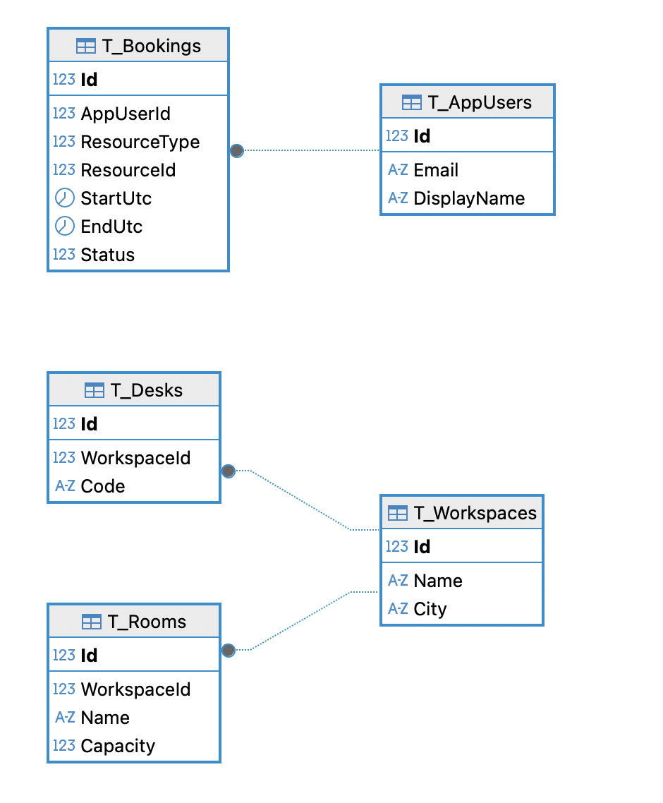

[](https://github.com/JugurthaDev/Workly/actions/workflows/tests.yml)

# Workly

> Plateforme de réservation d'espaces de travail (salles, bureaux, postes) construite avec .NET 9, Blazor Server, Minimal APIs, Keycloak, PostgreSQL & Traefik.

## Sommaire
- [Architecture](#architecture)
- [Technologies](#technologies)
 - [Schéma de la base de données](#schéma-de-la-base-de-données)
- [Fonctionnalités](#fonctionnalités)
- [Déploiement](#déploiement)
- [API](#api)
- [Mise en place locale](#mise-en-place-locale)
- [Variables d'environnement](#variables-denvironnement)
- [Tests](#tests)
- [Licence](#licence)

## Architecture
```
┌──────────────────────────────────────────────────────────┐
│                      Traefik (Edge)                      │
│          reverse proxy + ACME DNS challenge             │
└──────────────┬───────────────────────┬──────────────────┘
                │                       │
            (HTTPS)                       (HTTPS)
                │                       │
            WebApp (Blazor Server)   Keycloak (OIDC Provider)
                │                       │
                └─────────┬─────────────┘
                        │
                    ApiService (Minimal API)
                        │
                    PostgreSQL (Npgsql)
```
Composants :
- `tp_aspire_samy_jugurtha.WebApp` : Interface utilisateur Blazor Server, authentification OIDC, persistance des clés de DataProtection.
- `tp_aspire_samy_jugurtha.ApiService` : Minimal APIs sécurisées (JWT Bearer), EF Core + PostgreSQL, migration & seed automatique au démarrage.
- `tp_aspire_samy_jugurtha.AppHost` : Orchestrateur **.NET Aspire** pour le développement local (démarrage coordonné des projets + ressources conteneurisées, provisioning des realms Keycloak).
- `tp_aspire_samy_jugurtha.ServiceDefaults` : Extensions partagées (service defaults / instrumentation).
- `docker-compose.yml` : Orchestration de production (droplet DigitalOcean) avec Traefik + challenge DNS Cloudflare pour certificats.

## Schéma de la base de données



## Technologies
- .NET 9 (`net9.0`)
- Blazor Server
- Minimal APIs
- EF Core 9 + `Npgsql.EntityFrameworkCore.PostgreSQL`
- Authentification OIDC via Keycloak (roles, tokens, claims enrichis)
- JWT Bearer côté API / Cookies + OpenID Connect côté WebApp
- Traefik (reverse proxy, HTTPS, redirections, ACME DNS Cloudflare)
- PostgreSQL 16
- Docker Compose
- OpenAPI (documentation auto en dev via `app.MapOpenApi()`)

## Fonctionnalités
- Connexion / inscription via Keycloak (OIDC).
- Gestion des rôles (`user`, `admin`) et policies (`AdminOnly`, `UserOrAdmin`).
- CRUD basique des salles (`Room`).
- Réservation (`Booking`) avec vérification de chevauchement (détection `Conflict` si créneau occupé).
- Seed automatique de données de démonstration (utilisateur, workspace, salle) au démarrage de l'API.
- Ajout dynamique des rôles dans le ClaimsPrincipal via parsing `realm_access` (API & WebApp).
- Protection des clés de chiffrement (DataProtection) via volume `workly_dpkeys`.
- Version d'application exposée par variable `APP_VERSION` (utile pour observabilité / UI).

## Déploiement
En production, l'application est hébergée sur un Droplet **DigitalOcean** accessible via **https://worklyapp.fr**. Le fournisseur d'identité **Keycloak** est exposé séparément sur **https://auth.worklyapp.fr** (realm `Workly`).

Le domaine public principal est injecté via la variable `PUBLIC_HOST` (ex: `worklyapp.fr`).

Le workflow **CI GitHub** (badge en haut du fichier) construit et pousse automatiquement les images container à chaque intégration sur `main` (ou création de tag/version), puis la machine de production effectue un pull et un redeploy (mise à jour du `TAG`) assurant un déploiement continu sans intervention manuelle.

Images construites référencées par :
- `webapp` : `${REGISTRY_IMAGE}/webapp:${TAG}`
- `apiservice` : `${REGISTRY_IMAGE}/apiservice:${TAG}`

Traefik gère :
- Redirection HTTP → HTTPS
- Résolution certificats via ACME DNS Cloudflare
- Routage vers `worklyapp.fr` et `auth.worklyapp.fr`

Notes :
- L'orchestrateur **AppHost / Aspire** n'est pas utilisé en production (il reste un outil de développement local).
- Les variables sensibles (tokens Cloudflare, mots de passe DB) sont injectées via l'environnement ou un fichier `.env` non commité.

## API
Base : `https://worklyapp.fr` (via Traefik) ou `http://localhost:8081` en local pour l'API.

Endpoints principaux (tous protégés par JWT sauf mention) :
| Méthode | Endpoint              | Auth              | Description |
|---------|-----------------------|-------------------|-------------|
| GET     | `/api/rooms`          | Bearer (user/admin)| Liste des salles |
| POST    | `/api/rooms`          | Bearer (user/admin)| Création salle |
| GET     | `/api/bookings`       | Bearer (user/admin)| Réservations visibles utilisateur |
| GET     | `/api/bookings/all`   | Bearer (admin)     | Liste complète (admin) |
| POST    | `/api/bookings`       | Bearer (user/admin)| Nouvelle réservation (détection overlap) |
| DELETE  | `/api/bookings/{id}`  | Bearer (admin)     | Suppression réservation |

Réponse `409 Conflict` lors d'un chevauchement de créneau. Les identifiants des ressources (`ResourceType`, `ResourceId`) permettent de gérer salles, bureaux, etc.

## Mise en place locale
### Prérequis
- .NET SDK 9.x
- Docker & Docker Compose
- Accès (optionnel) à un compte Cloudflare si test ACME DNS (sinon retirer labels Traefik SSL).

### Cloner
```bash
git clone https://github.com/JugurthaDev/Workly.git
cd Workly
```

### Lancer la stack complète (développement)
Méthode recommandée : utiliser l'orchestrateur **Aspire** qui construit et démarre les projets + dépendances (PostgreSQL, Keycloak, etc.).
```bash
dotnet run --project tp_aspire_samy_jugurtha/tp_aspire_samy_jugurtha.AppHost
```
Accès une fois lancé :
- WebApp : http://localhost
- Keycloak : http://localhost:8090
- API : http://localhost:8081

Aspire gère le cycle de vie (arrêt CTRL+C), la reconstruction incrémentale et peut injecter de l'observabilité (dashboards si ajoutés plus tard).

### Mode production / simulation docker-compose (optionnel en local)
Utiliser `docker compose` uniquement pour tester une configuration proche de la production ou déployer sur le serveur.
Définir éventuellement les variables dans un fichier `.env` (voir section plus bas) puis :
```bash
docker compose up -d --build
```
Accès (mode compose) :
- WebApp : https://worklyapp.fr (si DNS + certificats) ou http://localhost
- Keycloak : https://auth.worklyapp.fr ou http://localhost:8090
- API : http://localhost:8081

### Démarrage manuel pour développement rapide
Dans un autre terminal :
```bash
dotnet run --project tp_aspire_samy_jugurtha/tp_aspire_samy_jugurtha.ApiService
dotnet run --project tp_aspire_samy_jugurtha/tp_aspire_samy_jugurtha.WebApp
```
Utiliser un Keycloak externe ou ajuster `Authentication:OIDC:*` dans `appsettings.Development.json`.

### Migrations
Les migrations EF sont appliquées automatiquement au démarrage (ligne `db.Database.Migrate();`). Pour créer une nouvelle migration :
```bash
dotnet ef migrations add NomMigration --project tp_aspire_samy_jugurtha/tp_aspire_samy_jugurtha.ApiService --startup-project tp_aspire_samy_jugurtha/tp_aspire_samy_jugurtha.ApiService
```

## Tests

Les tests utilisent xUnit et couvrent trois niveaux: unitaires API, intégration API, et E2E (UI) pour la WebApp avec Playwright.

Projets:
- Unitaires API: `tp_aspire_samy_jugurtha.ApiService.UnitTests`
- Intégration API: `tp_aspire_samy_jugurtha.ApiService.IntegrationTests`
- E2E WebApp (Playwright): `tp_aspire_samy_jugurtha.WebApp.E2E`

Exécuter toute la suite:

```bash
dotnet test
```

Notes et détails:
- Intégration API:
    - Hébergement via `WebApplicationFactory<Program>`.
    - Auth JWT remplacée par un schéma de test (headers `X-User`, `X-Roles`).
    - EF Core basculé sur `InMemory`; migrations/seed désactivés (`RunMigrations=false`).
    - Scénarios: `GET /api/rooms`, `POST /api/bookings` (201), conflit (409), `GET /api/bookings/all` (admin), `DELETE /api/bookings/{id}` (admin).
- E2E WebApp:
    - Playwright lance Chromium en mode headless et navigue sur la WebApp hébergée en Kestrel (port éphémère) directement dans le process de test.
    - L’auth OIDC est remplacée par une auth de test (utilisateur simulé) et `IWorklyClient` est remplacé par un client en mémoire pour des scénarios isolés de l’API.
    - Scénarios: affichage d’une salle de démonstration sur la page « Salles », création d’une réservation via le formulaire sur « Réservations » puis vérification de l’apparition dans la liste.
    - Premier run: Playwright télécharge automatiquement les navigateurs (Chromium/Firefox/WebKit). Cela peut prendre quelques minutes la première fois; les runs suivants sont rapides.

Exemples utiles:

```bash
# Lancer uniquement les tests E2E
dotnet test --filter FullyQualifiedName~tp_aspire_samy_jugurtha.WebApp.E2E

# Lancer uniquement les tests d’intégration API
dotnet test --filter FullyQualifiedName~tp_aspire_samy_jugurtha.ApiService.IntegrationTests
```

Bascules de test (automatiques en E2E):
- `E2E_TEST_AUTH=true` active l’authentification de test côté WebApp au lieu d’OIDC.
- `E2E_FAKE_CLIENT=true` remplace `IWorklyClient` par un client in-memory pour éviter des appels réels à l’API.
Ces variables sont positionnées par la fixture E2E; vous n’avez généralement rien à configurer manuellement.

## Variables d'environnement

### Fichier `.env` minimal (production docker-compose)
Actuellement le fichier `.env` utilisé en production ne contient que :

```env
CF_DNS_API_TOKEN=xxxxxxxxxxxxxxxxxxxxxxxxx
TRAEFIK_ACME_EMAIL=contact@worklyapp.fr
PUBLIC_HOST=worklyapp.fr
```

Description rapide :
- `CF_DNS_API_TOKEN` : Token API Cloudflare avec permissions DNS (Zone:DNS:Edit + Zone:Zone:Read) pour résoudre le challenge ACME et obtenir les certificats TLS via Traefik.
- `TRAEFIK_ACME_EMAIL` : Adresse email d'enregistrement ACME (Let's Encrypt) utilisée par Traefik.
- `PUBLIC_HOST` : Domaine principal servi par la WebApp (utilisé dans les labels Traefik et pour générer les URLs publiques).

Ces trois variables suffisent pour obtenir les certificats et exposer le site si la zone DNS Cloudflare pointe sur le serveur.

### Autres variables (optionnelles / selon besoins)
Exemples supplémentaires (voir `docker-compose.yml` ou `appsettings.*.json`) à définir si vous étendez la configuration :
- `POSTGRES_USER`, `POSTGRES_PASSWORD`, `POSTGRES_DB` : Credentials base.
- `OIDC_AUTHORITY` : URL realm Keycloak (ex: `https://auth.worklyapp.fr/realms/Workly`).
- `Authentication__OIDC__Authority` (API/WebApp) : Authority OIDC.
- `Authentication__OIDC__Audience` (API) : Audience JWT (ex: `workly-api`).
- `Authentication__OIDC__ClientId` (WebApp) : ClientId OIDC (ex: `workly-web`).
- `Services__ApiBaseUrl` (WebApp) : URL base des appels API (interne docker `http://apiservice:8080`).
- `ConnectionStrings__workly` : Chaîne PostgreSQL.
- `APP_VERSION` / `TAG` : Version déployée.
- `REGISTRY_IMAGE` : Préfixe des images (ex: `ghcr.io/jugurthadev/workly`).


## Licence
Distribué sous licence **GPL-3.0**. Voir le fichier [`LICENSE`](./LICENSE) pour le texte complet.